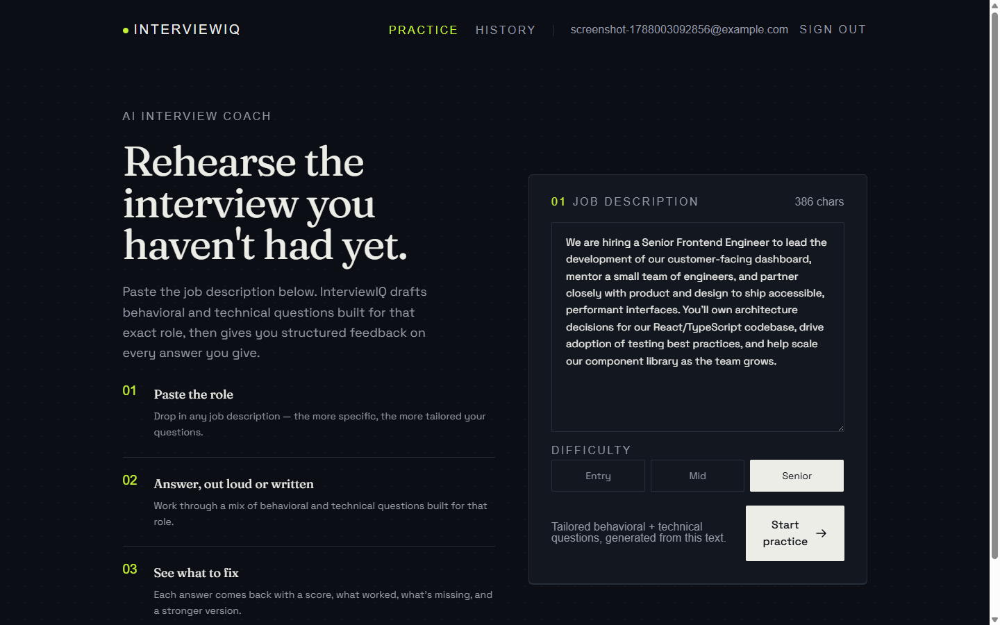
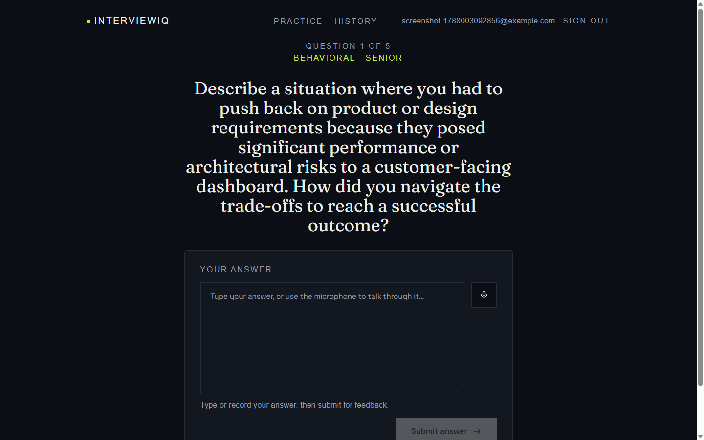
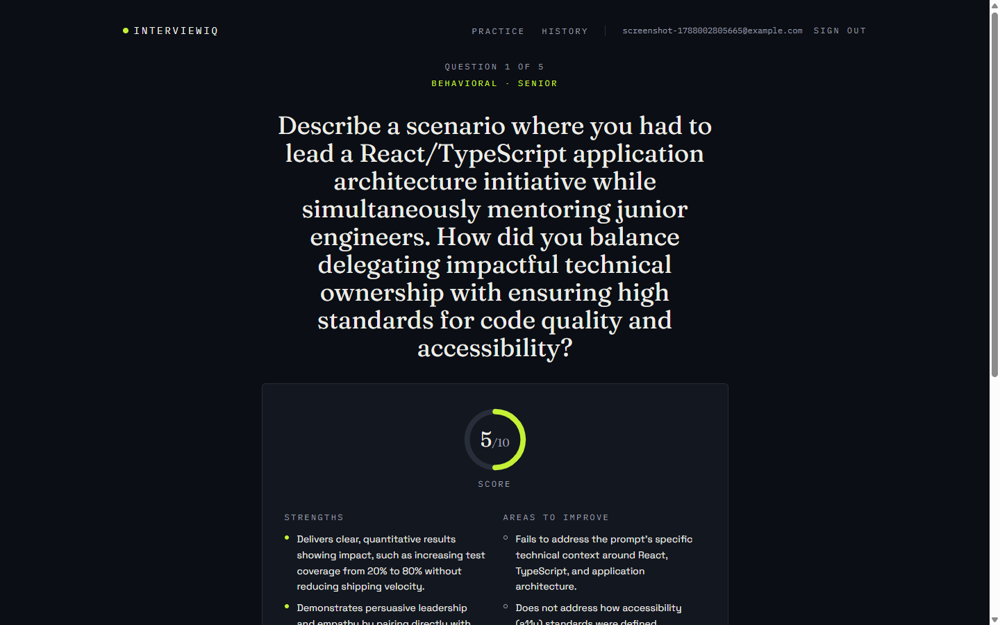
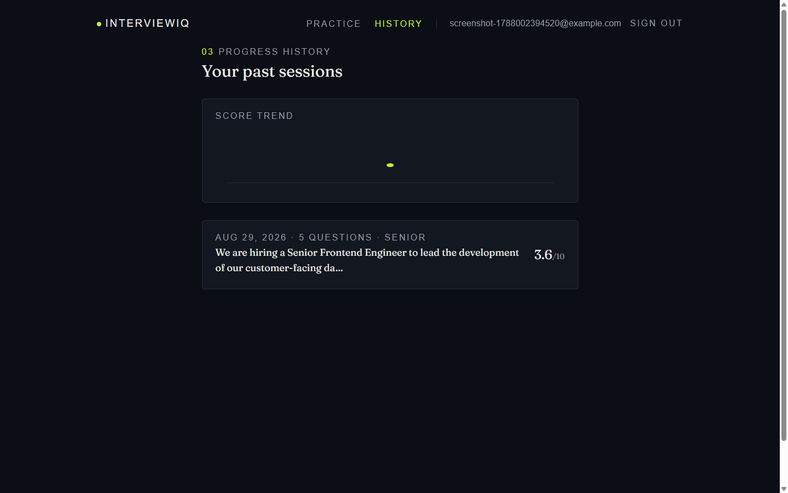

# InterviewIQ

An AI-powered interview practice coach that turns any job description into a tailored mock interview, then scores your answers with structured, actionable feedback.

**Live demo:** [ai-interview-psi-blush.vercel.app](https://ai-interview-psi-blush.vercel.app/)
**Repository:** [github.com/AmnaKhalil96/Ai-interview](https://github.com/AmnaKhalil96/Ai-interview)

## Screenshots






Captured from the real app (a signed-in test account, real Gemini calls, real Firestore data) at a 1440×900 desktop viewport — not mocked. `landing.png` shows the job description form filled in and ready to submit; `session.png` shows an active question mid-session; `feedback.png` shows the scored feedback view (score ring, strengths, gaps, rewritten answer) after an answer is evaluated; `history.png` shows a completed session on the history page. To refresh any of these later, sign in, walk through the flow, and re-save a PNG over the matching file in [`docs/screenshots/`](docs/screenshots/).

## What it does

Job seekers rarely get to rehearse against questions actually shaped by the role they're applying for. InterviewIQ solves that: paste a job posting, pick a difficulty level, and it generates five interview questions (a mix of behavioral and technical) built specifically for that posting. Answer each one by typing or speaking, and get back a score, concrete strengths and gaps, and a rewritten stronger answer — all backed by a real account so your practice history and score trends persist across sessions and devices.

## Features

- **AI-generated, role-specific questions** — 5 questions per session (3 behavioral, 2 technical), calibrated to entry/mid/senior difficulty, generated from the actual pasted job description rather than a generic question bank
- **Text or voice answers** — type your answer, or use the browser's built-in speech recognition to talk through it; voice input appends live to whatever's already typed
- **Structured AI evaluation** — every answer is scored 1–10 with a rubric that branches by question type: the **STAR method** (Situation, Task, Action, Result) for behavioral answers, **correctness / clarity / completeness** for technical ones — plus 2–4 specific strengths, 2–4 specific gaps, and a rewritten improved answer
- **Retry a question** — re-attempt any question before moving on, with no penalty and no stale state left behind
- **Session summary** — an average score ring, a one-line takeaway, and a per-question score breakdown the moment you finish
- **Copy feedback** — copy any question's full feedback (score, strengths, gaps, improved answer) to the clipboard as plain text, ready to paste into notes or an email
- **Authentication** — email/password and Google sign-in via Firebase Auth
- **Persistent history with score trends** — every finished session is saved to your account; the history page lists past sessions with expandable feedback and a score-trend chart across sessions

## Tech stack

| Layer | Technology |
|---|---|
| Framework | Next.js 14 (App Router), TypeScript |
| Styling | Tailwind CSS |
| Auth & database | Firebase Authentication, Cloud Firestore |
| AI | Google Gemini API (`@google/generative-ai`) |
| Unit/component testing | Vitest, React Testing Library |
| End-to-end testing | Cypress, cypress-axe |
| Auditing | Lighthouse (programmatic), axe-core |

## Setup & run locally

**Prerequisites:** Node.js 18.17 or later, npm, a [Firebase](https://console.firebase.google.com) project, and a [Google AI Studio](https://aistudio.google.com/apikey) API key.

```bash
git clone https://github.com/AmnaKhalil96/Ai-interview.git
cd Ai-interview
npm install
cp .env.local.example .env.local
```

Fill in `.env.local` with the following:

| Variable Name | Description | Where to get it |
|---|---|---|
| `NEXT_PUBLIC_FIREBASE_API_KEY` | Public Firebase Web API key identifying which Firebase project the client SDK talks to. Safe to ship in the browser bundle — Firebase's security model relies on Firestore/Auth rules, not on this key being secret. | Firebase Console → Project Settings → General → Your apps → SDK setup and configuration |
| `NEXT_PUBLIC_FIREBASE_AUTH_DOMAIN` | The domain Firebase Auth uses for its redirect/popup sign-in flows (`<project-id>.firebaseapp.com` by default). | Same as above |
| `NEXT_PUBLIC_FIREBASE_PROJECT_ID` | The Firebase project ID. Used client-side to initialize Firebase, and also read **server-side** by `lib/verifyIdToken.ts` as the expected issuer/audience when verifying a request's Firebase Auth ID token — no separate server secret needed since it's already public. | Same as above |
| `NEXT_PUBLIC_FIREBASE_STORAGE_BUCKET` | The Cloud Storage bucket tied to the Firebase project. Part of the standard SDK config object; not actively used by this app (no file uploads today). | Same as above |
| `NEXT_PUBLIC_FIREBASE_MESSAGING_SENDER_ID` | Sender ID for Firebase Cloud Messaging. Part of the standard SDK config object; not actively used by this app (no push notifications today). | Same as above |
| `NEXT_PUBLIC_FIREBASE_APP_ID` | The Firebase app ID identifying this specific web app registration within the project. | Same as above |
| `GEMINI_API_KEY` | Server-side-only key for the Gemini API, used by `lib/ai/generateQuestions.ts` and `lib/ai/evaluateAnswer.ts`. Never exposed to the browser (no `NEXT_PUBLIC_` prefix). | [Google AI Studio](https://aistudio.google.com/apikey) |

In the Firebase Console, also:
1. **Authentication → Sign-in method** — enable **Email/Password** and **Google**.
2. **Firestore Database** — create a database, then publish the rules in [`firestore.rules`](firestore.rules) (Firestore Database → Rules → paste → Publish). They restrict the `sessions` collection to userId-scoped read/create and disable update/delete entirely — the app already scopes every query the same way client-side, but these rules are what actually enforce it server-side.

Then run it:

```bash
npm run dev
```

Open [http://localhost:3000](http://localhost:3000).

## Architecture overview

```
src/
  app/                    Routes (Next.js App Router)
    page.tsx              Landing page (server component + JobDescriptionForm island)
    login/page.tsx         Email/password + Google sign-in
    session/page.tsx       One question at a time: answer, evaluate, retry, advance, summarize
    history/page.tsx       Past sessions, expandable feedback, score trend chart
    api/
      generate-questions/  POST route: auth + rate-limit gate, then validates input, calls lib/ai/generateQuestions
      evaluate-answer/     POST route: auth + rate-limit gate, then validates input, calls lib/ai/evaluateAnswer

  components/             Domain-specific components (know about interviews/auth)
    ui/                    Generic, reusable primitives (Button, TextArea, Kicker, ScoreRing, ...)

  lib/
    ai/                    Gemini integration — see below
    firebase.ts            Single Firebase app/Auth/Firestore init point
    auth.ts                signUp / signIn / signInWithGoogle / signOutUser + friendly error mapping
    sessions.ts             Firestore reads/writes for the `sessions` collection
    sessionSummary.ts       Client-side average score + one-line session summary
    practiceSession.ts      sessionStorage handoff of generated questions (landing → session page)
    difficulty.ts           Shared Difficulty type, labels, and validation guard
    verifyIdToken.ts        Server-side Firebase ID token verification (JWT, no Admin SDK)
    rateLimit.ts            In-memory per-user, per-route rate limiting
    requireAuthenticatedRequest.ts  Combines the two above into one gate both API routes call first
```

**The `lib/ai/` isolation pattern.** `generateQuestions.ts` and `evaluateAnswer.ts` each own *everything* Gemini-specific — the SDK, the model name, the prompt, the response schema, and the raw-text parsing/validation. Nothing outside these two files imports `@google/generative-ai`; the rest of the app only ever sees a typed `Question`/`Feedback` result or an `AIGenerationError` (`lib/ai/errors.ts`) with a `kind` of `api_error`, `invalid_response`, or `invalid_input`. Swapping providers later means rewriting the inside of these two files — the API routes, the pages, and the types they return don't change.

**Auth architecture.** `AuthProvider` (`components/AuthProvider.tsx`) wraps Firebase's `onAuthStateChanged` in a React context and exposes a single `useAuth()` hook returning `{ user, loading }`. Every page that needs auth (`session`, `history`, the practice form on the landing page) reads this hook directly rather than calling Firebase itself, and every Firestore query is issued only after `user` resolves, scoped by `where("userId", "==", user.uid)` — never fetched or shown before authentication succeeds.

**API route protection.** Both Gemini-backed routes (`/api/generate-questions`, `/api/evaluate-answer`) call `lib/requireAuthenticatedRequest.ts` as the very first line of the handler, before any request-body parsing. It does two things, in order:

1. **Authenticates.** `verifyIdToken.ts` pulls the token out of an `Authorization: Bearer <idToken>` header, then verifies it as a JWT against Google's published public keys for the `securetoken` service account (via the [`jose`](https://github.com/panva/jose) library) — checking signature, issuer, audience, and expiry. This deliberately skips the Firebase Admin SDK: Admin-based verification needs a service-account credential this project doesn't hold as a secret, so it instead follows Firebase's own documented alternative for environments without one. A missing or invalid token returns **401** immediately, before Gemini is ever called. (Verification failures that mean "the token is genuinely bad" become a 401; a failure to even reach Google's key endpoint is treated as a 500 and logged, so an infra hiccup is never mislabeled as "your session expired.")
2. **Rate-limits.** Once a uid is verified, `rateLimit.ts` checks a per-user, per-route in-memory counter — 20 requests/hour for question generation, 30/hour for answer evaluation (evaluation gets the higher ceiling since one practice session fires several evaluate-answer calls) — and returns **429** with a friendly "you've reached the practice limit for this hour" message if it's exceeded. The frontend shows this through the same styled error box every other API failure already uses, so no separate UI was needed.

This layer exists because client-side route protection (the landing page and `/session` redirecting signed-out visitors to `/login`) only stops the browser UI — it does nothing to stop a direct `curl` POST to either route, which would otherwise let anyone burn the app's Gemini quota with no account at all. Both routes also set `export const maxDuration = 30` (seconds) — above Gemini's own 20-second request timeout plus headroom for token verification, and comfortably under Vercel Hobby's 60-second function ceiling.

**Firestore schema.** One collection, `sessions`. Each document is one completed practice session:

```ts
{
  userId: string;
  jobDescription: string;
  difficulty: "entry" | "mid" | "senior";
  questions: { id: string; type: "behavioral" | "technical"; question: string }[];
  answers: string[];
  feedbacks: { score: number; strengths: string[]; gaps: string[]; improvedAnswer: string }[];
  averageScore: number;
  createdAt: Timestamp; // serverTimestamp()
}
```

History is fetched with a single equality filter on `userId` (sorted by date in JS afterward, not in the query) specifically to avoid requiring a manually-provisioned Firestore composite index for a tiny per-user dataset.

Server-side enforcement of that same `userId` scoping lives in [`firestore.rules`](firestore.rules) — a signed-in user may only read or create `sessions` documents where the document's `userId` matches their own `request.auth.uid`, and updates/deletes are disabled entirely (sessions are write-once).

## AI integration

**Model:** Google Gemini, via the `@google/generative-ai` SDK (model name is a single constant in each `lib/ai/*.ts` file, so upgrading models is a one-line change).

There are exactly **two** distinct AI calls in the app:

1. **`generateQuestions`** — one call does double duty: it first judges whether the pasted text is actually a plausible job description, and if so, writes 5 questions (3 behavioral, 2 technical) tailored to it and to the chosen difficulty. Validity-checking and question-writing are folded into a *single* call rather than a separate "is this valid?" call beforehand — a second call would double the latency and cost of every request just to filter a rare case.
2. **`evaluateAnswer`** — scores one submitted answer at a time: an integer 1–10, 2–4 strengths, 2–4 gaps, and a rewritten improved answer.

**Why structured JSON output.** Both calls set `responseMimeType: "application/json"` and pass an explicit `responseSchema` (Gemini's structured-output feature) instead of parsing free-form text. That's still treated as a floor, not a guarantee: both modules strip stray code fences defensively, then validate every field's type and shape before trusting it — a model returning syntactically valid JSON in the wrong shape raises a typed `AIGenerationError` instead of silently propagating bad data or crashing.

**Prompt design philosophy.** The evaluation rubric branches by question type rather than using one generic "was this good?" prompt: behavioral answers are graded against the **STAR method**, explicitly naming which of Situation/Task/Action/Result is missing or underdeveloped; technical answers are graded on **correctness, clarity, and completeness**. Grading both against a single generic rubric would blur that distinction and produce vaguer feedback.

Note: the session summary screen's one-line takeaway is **not** a third AI call — see Limitations below.

## Key decisions

The significant tradeoffs made along the way — the full reasoning for each lives as a comment next to the code it describes; this just collects them in one place.

- **Gemini over Claude, initially.** Chose Gemini's free tier over Claude API to keep infrastructure costs at zero during development and testing — the AI provider is isolated behind a single module (`lib/ai/`), so switching to Claude or another provider later is a contained change, not a rewrite.
- **JSON-schema-enforced AI responses, not free text.** Both Gemini calls set `responseMimeType: "application/json"` and pass an explicit `responseSchema` rather than parsing prose. That's treated as a floor, not a guarantee: both modules still strip stray code fences and validate every field's type/shape before trusting it, raising a typed `AIGenerationError` instead of crashing or silently propagating a malformed response.
- **In-memory rate limiting, not a dedicated service like Upstash.** `lib/rateLimit.ts` keeps per-user counters in a plain in-memory `Map`. Vercel serverless functions don't guarantee shared memory across concurrent instances, so this is a best-effort limiter, not a hard distributed guarantee — but at capstone-project scale (not high-traffic production), that's a reasonable trade against the operational overhead of a shared store. The file documents the upgrade path if that ever changes: swap the internals for Firestore-based counting or a managed store, without touching anything that calls it.
- **Firestore over a SQL database.** Sessions live in Firestore, paired with the Firebase Auth already in use — one vendor, one SDK, and security rules (`firestore.rules`) that key directly off `request.auth.uid` with no separate ORM or connection-pooling layer to run. `lib/sessions.ts` also deliberately skips an `orderBy` in its query, sorting the small per-user result set in JS instead, specifically to avoid provisioning a Firestore composite index — a fine trade at "one person's handful of practice sessions" scale.
- **Session summary is aggregated client-side, not a sixth AI call.** The one-line takeaway on the summary screen reuses the best-scoring answer's top strength and the worst-scoring answer's top gap from feedback Gemini already returned (`lib/sessionSummary.ts`), instead of firing another request. Three documented reasons: reliability (one more network call that can fail with nothing to show for it, versus local aggregation that can't fail at all), groundedness (reusing real per-answer feedback keeps the summary exactly as concrete as what Gemini already said, instead of re-deriving that from a summarization prompt with no such guarantee), and cost/latency (this is free and instant).

## Testing

```bash
npm run test           # Vitest — unit/component tests
npm run test:coverage  # Vitest with a coverage report
npm run test:e2e       # Cypress — full end-to-end suite
npm run test:a11y      # Cypress — accessibility spec only
```

**Current coverage** (`npm run test:coverage`): 136 tests across 16 files, all passing — **71% statements / 74% branches / 74% functions / 72% lines** overall. Coverage isn't evenly spread on purpose: `lib/` (the AI response parsing/validation, auth error mapping, session math, Firestore access) sits around **93%** statements, since that's where the logic worth unit-testing in isolation lives. A handful of components (`AuthProvider`, `JobDescriptionForm`, `SiteHeader`, `ScoreTrendChart`) show low or 0% in the Vitest report specifically because they're exercised end-to-end by the Cypress suite instead — real sign-up, real Firestore, mocked Gemini routes — not because they're untested.

**What's covered:**
- **Vitest** — both Gemini call sites' happy paths and malformed-response edge cases, auth error-message mapping, session-summary math (including tie-breaking), difficulty validation, garbage-input detection, and component tests for `Button`, `LoginForm`, `AnswerInput`, `ScoreRing`, `CopyFeedbackButton`, `DifficultySelector`, and `FeedbackDisplay`.
- **Cypress** — three full specs: the happy-path practice flow (real sign-up → generate questions → answer all 5, including one retry → session summary → appears in history), the evaluation-error-and-recovery path, and a full accessibility audit across every page and major UI state.

**Browser compatibility.** Vitest and Cypress both run against Chromium (Electron), so cross-browser correctness still needs a manual pass. Status below — replace "Not yet verified" with "Verified" (plus today's date) as each one is actually checked by hand:

| Browser | Platform | Status |
|---|---|---|
| Chrome | Desktop | Verified — 2026-08-29 |
| Firefox | Desktop | Verified — 2026-08-29 |
| Safari | Desktop (macOS) | Verified — 2026-08-29 |
| Safari | Mobile (iOS) | Verified — 2026-08-29 |

Worth specifically confirming on the Firefox pass: voice input uses the Web Speech API, which Firefox doesn't support. `AnswerInput.tsx` feature-detects this (`window.SpeechRecognition || window.webkitSpeechRecognition`) and hides the mic button entirely rather than showing one that silently does nothing — worth confirming that degrades as expected rather than assuming it from the code alone.

## Known limitations & future improvements

- **In-memory rate limiting is best-effort, not a hard distributed guarantee.** Both AI routes require a verified Firebase ID token and enforce a per-user hourly cap (20/hour for question generation, 30/hour for answer evaluation — see "Architecture overview" and "Key decisions"), returning a friendly 429 when exceeded. The counter lives in each serverless function instance's own memory rather than a shared store, so a burst spread across multiple concurrent instances could exceed the nominal limit by some multiple of instance count. Beyond the app's own limit, a large enough burst could still hit Gemini's own provider-side quota, surfaced as a generic "AI request failed" message rather than a specific rate-limit notice.
- **Session summary is aggregated client-side, not a dedicated AI call.** The one-line takeaway on the summary screen reuses the best-scoring answer's top strength and the worst-scoring answer's top gap from feedback Gemini already returned, rather than firing a sixth AI request. This is a deliberate reliability/cost trade-off (documented in `lib/sessionSummary.ts`), but it means the summary can't say anything more insightful than what the per-question feedback already said.
- **Single AI provider.** Only Gemini is wired in today. The `lib/ai/` isolation pattern (above) was built specifically so adding or swapping providers means editing `generateQuestions.ts`/`evaluateAnswer.ts` internals, not touching the API routes, pages, or types.
- **`/history` is client-rendered.** There's no server-side session cookie, so the history page can't render real data until Firebase Auth resolves client-side and a Firestore query completes — see `docs/lighthouse-audit.md` for how this was mitigated (a properly-sized loading skeleton) without weakening the auth model.
- **Firestore rules must be published manually.** [`firestore.rules`](firestore.rules) is checked into this repo, but Firestore doesn't read a repo file automatically — it has to be pasted into the Firebase Console (or deployed via the Firebase CLI) per the Setup section above, and it's possible for the console's live rules to drift from the file if someone edits one without the other.

## Accessibility & performance

- **Accessibility:** audited with axe-core's full rule set (every WCAG 2.0/2.1 A + AA rule, plus best-practice rules) against the production build, across every page and major UI state — **0 violations**. See [`docs/accessibility-audit.md`](docs/accessibility-audit.md) for what was found and fixed (heading order, missing headings, focus management on in-page transitions).
- **Performance:** audited with Lighthouse against a production build. Final scores — Landing: **90** mobile / **100** desktop; History (authenticated): **92** mobile / **100** desktop; Accessibility, Best Practices, and SEO are a clean **100** across every page and form factor. See [`docs/lighthouse-audit.md`](docs/lighthouse-audit.md) for the full before/after breakdown, including the font and client-side-auth-loading fixes that got history-mobile from 50 to 92.

## How AI tools built this

I used an AI coding assistant (Claude, via Claude Code) throughout development — from the initial Next.js scaffold through the auth/rate-limiting hardening described above. This section is meant to be specific about what that actually looked like, not a generic "AI helped me code faster" disclaimer.

**What it was good at:**

- **Implementing well-specified features quickly.** Once a feature's shape was clear — the Gemini structured-output schema and prompts for `generateQuestions`/`evaluateAnswer`, the Firestore session read/write shape in `lib/sessions.ts`, the auth-and-rate-limit gate (`lib/requireAuthenticatedRequest.ts`) added most recently — implementation and the tests around it came together fast, with little back-and-forth.
- **Catching real bugs during self-testing, not just writing code that looked plausible.** Three concrete examples from the actual build:
  - **The flexbox `min-width` overflow bug.** A flex item's default `min-width` is `auto` (the width of its longest unbreakable token), not `0` — so a `break-words` class silently does nothing until `min-w-0` is also set. This showed up identically in the feedback strengths/gaps list (`FeedbackDisplay.tsx`) and the session summary's per-question breakdown (`app/session/page.tsx`): a long AI-generated sentence, or an unbroken pasted string, could push a card wider than the viewport. It surfaced during a dedicated mobile-width testing pass, not by inspection — `docs/reflection.md` has the fuller story, including that it took finding the same bug three separate times before recognizing the one root cause behind all of them.
  - **Firebase Auth's default proactive GAPI iframe load on mobile.** While chasing why `/history` scored only 71 on Lighthouse mobile Performance, the real cause turned out to be two layers deeper than expected: `getAuth(app)`'s default `browserPopupRedirectResolver` eagerly opens a hidden Google API iframe on *every* mobile page load — including pages like `/history` that never touch Google Sign-In — because that resolver's internal `_shouldInitProactively` check just tests "is this a mobile browser or Safari." That's a detail found by reading into `@firebase/auth`'s own compiled source, not something documentation surfaces. Fixed in `lib/firebase.ts` by switching to `initializeAuth()` and supplying the resolver only at the moment `signInWithPopup` is actually called (`lib/auth.ts`), which removed the iframe load without changing auth behavior at all. Full before/after in `docs/lighthouse-audit.md`.
  - **The Gemini timeout/`AbortController` wiring.** Both `generateQuestions.ts` and `evaluateAnswer.ts` pass `GEMINI_TIMEOUT_MS` (20s) as the SDK's own `RequestOptions.timeout` rather than a manual `Promise.race` — that option wires into a real `AbortController` tied to the underlying fetch, so a stalled Gemini request is genuinely cancelled instead of just abandoned while it keeps running server-side, and a distinct `GoogleGenerativeAIAbortError` branch surfaces a specific "taking too long" message instead of a generic failure.

**What needed my own judgment, not the assistant's:**

- **The project idea and scope.** Deciding InterviewIQ was worth building — that the real barrier to interview practice is access to someone qualified to give feedback, not motivation (see `docs/project-brief.md`) — and scoping it to five questions, two question types, and one AI provider for a capstone timeline.
- **Choosing Gemini over Claude, considering cost.** A free-tier-friendly starting point for a project with no budget, with the tradeoff (see "Key decisions" above) fully understood going in, not just accepted after the fact.
- **Deciding to add real authentication instead of anonymous IDs.** Once the app was going to be publicly deployed and calling a metered AI API, an anonymous-ID scheme wouldn't have given the rate limiter — or the Firestore security rules — anything trustworthy to key off. Real accounts were a deliberate call, not a default.
- **Deciding to actually fix the History page's performance, not just document it as a limitation.** The easy path after seeing a 71 mobile Performance score would have been a "known limitations" bullet. Choosing to read the actual Lighthouse JSON, find the real LCP element, and ship a properly-sized skeleton (`docs/lighthouse-audit.md`, round 2) instead of settling was a deliberate call to fix it properly rather than write around it.
- **Reviewing and personalizing `docs/reflection.md`.** The reflection document is my own account of what was actually hardest and what I'd do differently next time — reviewed and written in my own words, not left as generated boilerplate.
